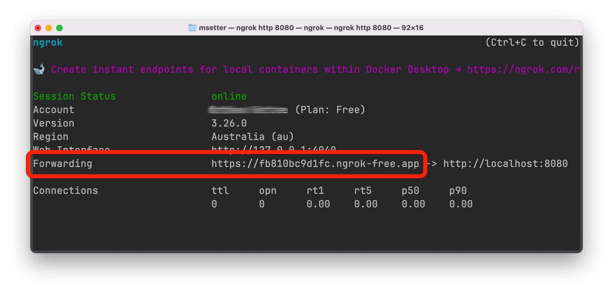
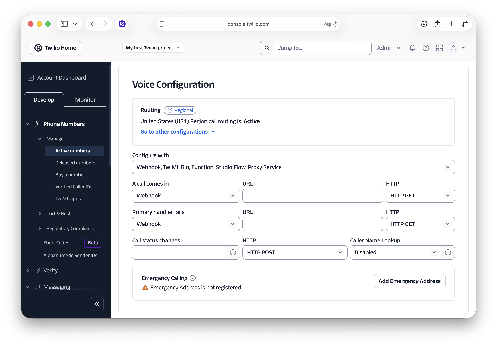

<!-- markdownlint-disable MD013 -->

# An IVR Built With PHP and Twilio

This project shows the essentials of building an IVR (Interactive Voice Response) in PHP with Twilio.

While IVRs can come in many shapes and sizes, the one in this application is a simplistic, partial implementation which you might encounter when you call a bank/insurance company.
You can see the IVR flow in the image below.


## Prerequisites

You'll need the following to use the application:

- A Twilio account (free or paid).
  [Create an account][twilio-referral-url] if you don't already have one.
- PHP 8.4 or above
- [Composer][composer] installed globally
- Git
- Your preferred code editor or IDE
- Some terminal experience is helpful, though not required

## Quick Start

To get started with the project, you need to clone it locally and start it, by running the commands below:

```bash
git clone git@github.com:settermjd/php-ivr.git php-ivr
cd php-ivr
composer install
composer serve
```

Now, create a secure tunnel to the internet to the locally running application using ngrok.

```bash
ngrok http 8080
```

Then, copy the **Forwarding URL** printed to the terminal output.
You'll need it in in a moment.



With that done, you need to configure your Twilio phone number to call the application when calls are made to your Twilio phone number.
To do that, log in to the Twilio Console, then, in the left-hand side navigation menu, go to **Phone Numbers > Manage > Active numbers**.

There, click on your Twilio phone number.
In the Voice Configuration section, set:

- **Configure with** to "Webhook, TwiML Bin, Function, Studio Flow, Proxy Service"
- **A call comes in** to "Webhook", its **URL** field to your ngrok Forwarding URL, and its **HTTP** field to "HTTP GET"

After that, scroll to the bottom of the page and click **Save configuration**.



## Using the application

With the application configured, to use it, make a call to your Twilio phone number.
Then, step through the IVR, using the IVR flow screenshot above to help you out.

## Contributing

If you want to contribute to the project, whether you have found issues with it or just want to improve it, here's how:

- [Issues][github-issues]: ask questions and submit your feature requests, bug reports, etc
- [Pull requests][github-prs]: send your improvements

## License

[MIT][mit-license]

## Disclaimer

No warranty expressed or implied. Software is as is.

<!-- Links -->

[composer]: https://getcomposer.org
[github-issues]: https://github.com/settermjd/php-ivr/issues
[github-prs]: https://github.com/settermjd/php-ivr/pulls
[mit-license]: http://www.opensource.org/licenses/mit-license.html
[twilio-referral-url]: https://twilio.com/try-twilio

<!-- markdownlint-enable MD013 -->
